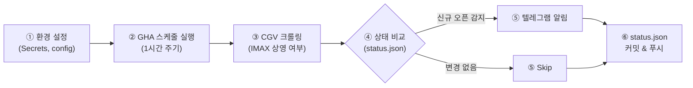

# [PRD v1.0] GitHub Actions 기반 용아맥(CGV 용산 IMAX) 예매 알리미

> **문서 버전**: 1.0  
> **작성일**: 2026-07-15  
> **상태**: Approved  

---

## 1. 개요 (Overview)

* **프로젝트명**: Yong-IMAX Watcher (용아맥 예매 개시 알리미)
* **목적**: CGV 용산아이파크몰 IMAX관의 예매 오픈 여부를 자동 감지하여, 예매가 열렸을 때 텔레그램으로 즉시 알림을 수신한다.
* **핵심 원칙**:

| 원칙 | 설명 |
|---|---|
| **Zero-Cost Infrastructure** | 별도 서버 없이 GitHub Actions 무료 티어만 활용 |
| **State Management** | 중복 알림 방지를 위해 상태를 `status.json`으로 커밋/푸시하여 관리 |
| **Smart Schedule** | 새벽 시간대 제외, 주기적 배치 실행으로 리소스 낭비 방지 |
| **Fail-Safe** | 외부 서비스 장애 시에도 상태 유실 없이 안전하게 동작 |

---

## 2. 사용자 시나리오 (User Scenario)



1. **환경 설정**: 사용자는 텔레그램 Bot 토큰, 채팅방 ID를 GitHub Secrets에 등록하고, 감시 대상 날짜를 `config.json`에 설정한다.
2. **주기적 감시**: GitHub Actions가 KST 08:00~23:00 사이 1시간 간격으로 자동 실행된다.
3. **크롤링**: 스크립트가 CGV 서버에서 대상 날짜들의 상영시간표 데이터를 가져온다.
4. **상태 비교 및 탐지**: 이전 상태(`status.json`)와 비교하여 `false → true` 전환된 경우에만 알림을 발송한다.
5. **상태 업데이트**: 최신 크롤링 결과를 `status.json`에 쓰고, GitHub Actions 봇이 자동 Commit & Push한다.

---

## 3. 기능 요구사항 (Functional Requirements)

### F-1. 감시 대상 설정 (Target Configuration)

* 감시 대상 날짜는 `config.json` 파일에서 관리한다.
* **데이터 구조**:
  ```json
  {
    "theater_code": "0013",
    "theater_name": "CGV 용산아이파크몰",
    "target_dates": ["20260722", "20260723", "20260724"]
  }
  ```
* 사용자는 필요 시 `config.json`을 직접 수정하여 감시 날짜를 추가/제거한다.
* `workflow_dispatch` 트리거를 통해 수동으로도 즉시 실행할 수 있다.

### F-2. 예매 현황 크롤링 엔진

* CGV 용산아이파크몰(`theatercode=0013`)의 `target_dates` 리스트를 순회하며 크롤링한다.
* 상영시간표 iframe 주소를 타겟으로 동작한다:
  ```
  http://www.cgv.co.kr/common/showtimes/iframeTheater.aspx?theatercode=0013&date={YYYYMMDD}
  ```
* 응답 HTML에서 `span.imax` 태그의 존재 유무로 IMAX 상영 오픈 여부를 판별한다.
* IMAX 섹션이 존재할 경우, 해당 영화 제목도 함께 파싱한다.

### F-3. 상태 저장 및 중복 알림 방지 (State Management)

* 매 실행 시 `status.json` 파일을 읽고 쓴다.
* **데이터 구조**:
  ```json
  {
    "last_checked": "2026-07-15T18:00:00+09:00",
    "dates": {
      "20260722": { "imax_opened": false, "movie_title": "", "first_detected_at": null },
      "20260723": { "imax_opened": true, "movie_title": "인셉션 재개봉", "first_detected_at": "2026-07-15T14:00:00+09:00" }
    }
  }
  ```
* **알림 발송 트리거 조건**: 이전 상태에서 `imax_opened: false`였으나 현재 크롤링 결과 `true`로 전환된 경우에만 알림을 보낸다.
  * 이미 `true`인 상태가 지속되면 재알림하지 않는다.
* **데이터 정리(Pruning)**: 크롤링 실행 시점 기준 날짜가 이미 지난 `target_date` 항목은 `status.json`에서 자동 제거한다.

### F-4. GitHub Actions 자동 커밋 및 푸시

* 크롤링 후 업데이트된 `status.json`을 Workflow 내에서 `git commit && git push`한다.
* Workflow 권한으로 `contents: write`를 부여한다.
* 커밋 메시지 형식: `chore: update status.json [skip ci]`
  * `[skip ci]`를 포함하여 커밋에 의한 재실행을 방지한다.

### F-5. 텔레그램 알림 시스템

* 신규 오픈 감지 시, 텔레그램 Bot API(`sendMessage`)를 통해 Markdown 형식의 메시지를 발송한다.
* **알림 메시지 템플릿**:
  ```
  🔔 용아맥 예매 오픈! 🔔

  🎬 영화: {movie_title}
  📅 상영일: {target_date (YYYY.MM.DD 형식)}
  🕐 감지 시각: {detected_at}

  👉 지금 바로 예매하세요!
  https://m.cgv.co.kr/WebApp/MovieV4/movieDetail.aspx?theaterCd=0013&date={YYYYMMDD}
  ```

---

## 4. 비기능 요구사항 (Non-Functional Requirements)

### N-1. 스케줄링

* GitHub Actions `cron` 스케줄러 사용 (UTC 기준).
* **동작 범위**: KST 08:00 ~ 23:00 → UTC 23:00(전날) ~ 14:00(당일)
* **Cron Expression**: `0 23,0-14 * * *` (매시 정각, 하루 16회)
* **리소스 추정**: 1회 실행 ~1분 × 16회 × 30일 = **약 480분/월** (무료 티어 2,000분 내 안전)
* `workflow_dispatch` 이벤트도 함께 등록하여 수동 즉시 실행을 지원한다.

### N-2. 보안 관리 (GitHub Secrets)

| Secret Name | 용도 |
|---|---|
| `TELEGRAM_BOT_TOKEN` | 텔레그램 봇 인증 토큰 |
| `TELEGRAM_CHAT_ID` | 알림 수신 대상 채팅방 ID |

* 모든 민감 정보는 코드에 하드코딩하지 않고 GitHub Repository Secrets로 관리한다.

### N-3. 에러 핸들링 및 안정성

| 장애 시나리오 | 대응 정책 |
|---|---|
| CGV 서버 응답 실패 (5xx, timeout) | 최대 3회 재시도 (간격 5초), 모두 실패 시 해당 실행 스킵. `status.json` 변경 없음 |
| HTML 구조 변경 (셀렉터 무효화) | 파싱 결과가 비정상(모든 날짜 데이터 0건)이면 텔레그램으로 **경고 알림** 발송 |
| `git push` 실패 | Workflow 자체 실패로 기록. 다음 실행 시 이전 상태 기반으로 재비교 (상태 유실 없음) |
| Telegram API 장애 | 최대 2회 재시도 후 실패 시 로그만 남기고 종료. 상태는 정상 업데이트 |

* HTTP 요청 시 브라우저 `User-Agent` 헤더를 필수로 설정한다.
* 요청 간 1~2초 랜덤 딜레이를 두어 Rate Limit을 방지한다.

### N-4. 테스트 전략

| 유형 | 내용 |
|---|---|
| **유닛 테스트** | CGV 응답 HTML 모킹을 통한 파싱 로직 검증 |
| **Dry-run 모드** | 환경변수 `DRY_RUN=true` 설정 시 텔레그램 실제 발송 없이 로그만 출력 |
| **수동 트리거** | `workflow_dispatch`를 통한 즉시 실행으로 전체 파이프라인 E2E 검증 |

---

## 5. 시스템 아키텍처 및 폴더 구조

```text
ymax-watcher/
├── .github/
│   └── workflows/
│       └── run_watcher.yml    # GitHub Actions 워크플로우 정의
├── docs/
│   └── PRD_v1.0.md            # 본 문서
├── tests/
│   ├── test_crawler.py        # 크롤링 파서 유닛 테스트
│   └── fixtures/              # 테스트용 HTML 응답 모킹 파일
│       └── sample_response.html
├── config.json                # 감시 대상 설정 (theater_code, target_dates)
├── status.json                # 예매 상태 저장 파일 (GHA가 자동 커밋)
├── watcher.py                 # 메인 로직 (크롤링, 상태 비교, 알림)
├── requirements.txt           # 의존 패키지 (requests, beautifulsoup4)
└── README.md
```

---

## 6. 범위 정의

### In Scope (v1.0)
- CGV 용산아이파크몰 IMAX관 단일 상영관 감시
- 텔레그램 단일 채널 알림
- GitHub Actions + `status.json` 커밋 기반 상태 관리

### Out of Scope
- 실제 예매 자동화 (티켓팅 봇) — **명시적으로 범위 밖**
- 멀티 영화관 동시 감시 (e.g., 여의도, 강변)
- IMAX 외 특수관 감시 (ScreenX, 4DX, Dolby 등)
- Discord / Slack 등 다채널 알림
- 웹 대시보드 UI

### Future Enhancements (v2.0+)
- 다중 영화관 / 다중 특수관 지원
- Discord, Slack, 카카오톡 알림 채널 추가
- 예매 오픈 임박 시 실행 주기 동적 증가 (15분 간격)
- 좌석 현황 모니터링

---

## 7. 의존성 및 제약사항

| 항목 | 설명 |
|---|---|
| **CGV 비공식 웹페이지** | 공식 API가 아닌 웹 크롤링 의존 — CGV 측 HTML 구조 변경 시 파서 수정 필요 |
| **GitHub Actions 무료 티어** | 월 2,000분 한도. 현재 설계상 ~480분/월 소비 예상 |
| **GitHub Actions cron 정확도** | 시스템 부하에 따라 최대 5~15분 지연 실행 가능 |
| **텔레그램 Bot API** | Rate Limit: 같은 채팅에 초당 1건 이하 권장 |

---

## 8. 성공 지표 (KPI)

| 지표 | 목표 |
|---|---|
| **알림 지연 시간** | 예매 오픈 후 최대 **1시간 이내** 알림 수신 (크론 주기 = 1h) |
| **False Positive** | 미오픈 상태에서 오픈 알림 발송 **0건** |
| **중복 알림** | 동일 날짜 동일 영화에 대해 알림 **1회만** 발송 |
| **시스템 가용성** | 월간 정상 실행률 **95% 이상** (GHA 장애 제외) |
