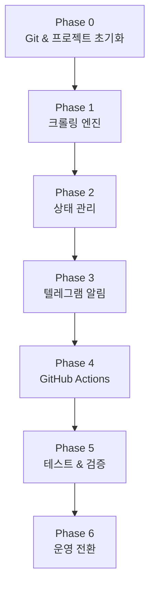

# 작업 절차서 — Yong-IMAX Watcher v1.0

> **기준 문서**: [PRD v1.0](file:///Users/ultimate/Workspace/personal/project/ymax-watcher/docs/PRD_v1.0.md)  
> **작성일**: 2026-07-15  

---

## 작업 흐름 요약



---

## Phase 0. Git 저장소 및 프로젝트 초기화

### 0-1. GitHub 리포지토리 생성

```bash
# GitHub에서 새 리포지토리 생성 (웹 UI 또는 gh CLI)
gh repo create ymax-watcher --public --description "CGV 용산 IMAX 예매 오픈 알리미"
```

> [!NOTE]
> `gh` CLI가 미설치된 경우 GitHub 웹에서 직접 생성해도 동일합니다.

### 0-2. 로컬 프로젝트 초기화

```bash
cd /Users/ultimate/Workspace/personal/project/ymax-watcher

# Git 초기화 및 원격 연결
git init
git remote add origin https://github.com/{username}/ymax-watcher.git

# 기본 브랜치 설정
git branch -M main
```

### 0-3. 프로젝트 스캐폴딩

아래 디렉토리/파일 구조를 생성합니다:

```
ymax-watcher/
├── .github/workflows/       # Phase 4에서 작성
├── .gitignore
├── docs/
│   └── PRD_v1.0.md          # ✅ 이미 존재
├── tests/
│   ├── __init__.py
│   ├── test_crawler.py      # Phase 5에서 작성
│   └── fixtures/
│       └── sample_response.html
├── config.json
├── status.json
├── watcher.py
├── requirements.txt
└── README.md
```

### 0-4. 기본 파일 작성

**`.gitignore`**
```gitignore
__pycache__/
*.pyc
.env
venv/
.venv/
```

**`requirements.txt`**
```
requests>=2.31.0
beautifulsoup4>=4.12.0
```

**`config.json`** (초기 템플릿)
```json
{
  "theater_code": "0013",
  "theater_name": "CGV 용산아이파크몰",
  "target_dates": []
}
```

**`status.json`** (초기 상태)
```json
{
  "last_checked": null,
  "dates": {}
}
```

### 0-5. 초기 커밋 및 푸시

```bash
git add .
git commit -m "chore: project scaffolding"
git push -u origin main
```

### 0-6. GitHub Secrets 등록

GitHub 리포지토리 → Settings → Secrets and variables → Actions에서 등록:

| Secret Name | 값 |
|---|---|
| `TELEGRAM_BOT_TOKEN` | BotFather에서 발급받은 토큰 |
| `TELEGRAM_CHAT_ID` | 알림 수신 채팅방 ID |

> [!IMPORTANT]
> Secrets 등록 없이는 텔레그램 알림이 동작하지 않습니다. Phase 3 테스트 전까지 반드시 완료하세요.

---

## Phase 1. 크롤링 엔진 구현 (`watcher.py` — 크롤링 파트)

### 1-1. 핵심 구현 사항

| 항목 | 상세 |
|---|---|
| **대상 URL** | `http://www.cgv.co.kr/common/showtimes/iframeTheater.aspx?theatercode={code}&date={YYYYMMDD}` |
| **판별 기준** | 응답 HTML 내 `span.imax` 태그 존재 여부 |
| **영화 제목 추출** | IMAX 섹션 내 영화명 텍스트 파싱 |
| **User-Agent** | 브라우저 UA 문자열 필수 설정 |
| **요청 딜레이** | 날짜별 요청 간 `1~2초` 랜덤 sleep |
| **재시도** | 5xx 또는 timeout 시 최대 3회, 간격 5초 |

### 1-2. 함수 설계

```python
def load_config() -> dict
    # config.json 읽기

def fetch_showtimes(theater_code: str, date: str) -> str | None
    # HTTP 요청, 재시도 포함. 성공 시 HTML 반환, 실패 시 None

def parse_imax_status(html: str) -> tuple[bool, str]
    # HTML 파싱 → (imax_opened: bool, movie_title: str)
```

### 1-3. 완료 기준

- [x] `config.json`에서 설정 로드
- [x] 지정 날짜 단건 크롤링 성공
- [x] `span.imax` 유무 정확 판별
- [x] 영화 제목 정상 추출
- [x] 재시도 로직 동작 확인
- [x] 커밋: `feat: implement crawling engine`

---

## Phase 2. 상태 관리 구현 (`watcher.py` — 상태 파트)

### 2-1. 핵심 구현 사항

| 항목 | 상세 |
|---|---|
| **읽기** | `status.json` 로드. 파일 없으면 빈 초기 상태 생성 |
| **비교** | 날짜별 `imax_opened` 이전값과 현재값 비교 |
| **알림 트리거** | `false → true` 전환 시에만 알림 대상 리스트에 추가 |
| **Pruning** | 현재 날짜보다 과거인 항목은 `dates`에서 자동 제거 |
| **쓰기** | `last_checked` 타임스탬프 갱신 후 파일 저장 |

### 2-2. 함수 설계

```python
def load_status() -> dict
    # status.json 읽기 (없으면 기본값)

def save_status(status: dict) -> None
    # status.json 쓰기

def compare_and_detect(old_status: dict, current_results: dict) -> list[dict]
    # 변경 감지. 알림 대상 리스트 반환
    # 각 항목: {"date": "20260722", "movie_title": "인셉션 재개봉"}

def prune_past_dates(status: dict) -> dict
    # 지난 날짜 항목 제거
```

### 2-3. 완료 기준

- [x] `status.json` 정상 읽기/쓰기
- [x] `false → true` 전환 정확 감지
- [x] `true → true` 유지 시 알림 미발생
- [x] 과거 날짜 자동 정리
- [x] 커밋: `feat: implement state management`

---

## Phase 3. 텔레그램 알림 구현 (`watcher.py` — 알림 파트)

### 3-1. 핵심 구현 사항

| 항목 | 상세 |
|---|---|
| **API** | `https://api.telegram.org/bot{token}/sendMessage` |
| **인증** | 환경변수 `TELEGRAM_BOT_TOKEN`, `TELEGRAM_CHAT_ID` |
| **메시지 포맷** | PRD F-5 템플릿 참조. 용산 IMAX 딥링크 포함 |
| **Dry-run** | 환경변수 `DRY_RUN=true` 시 발송 대신 로그 출력 |
| **재시도** | API 실패 시 최대 2회 재시도 |
| **경고 알림** | 전체 파싱 실패(데이터 0건) 시 별도 경고 메시지 발송 |

### 3-2. 함수 설계

```python
def send_telegram_alert(movie_title: str, target_date: str) -> bool
    # 예매 오픈 알림 발송. 성공 시 True

def send_telegram_warning(message: str) -> bool
    # 시스템 경고 알림 발송

def is_dry_run() -> bool
    # DRY_RUN 환경변수 확인
```

### 3-3. 완료 기준

- [x] 텔레그램 메시지 정상 수신 확인
- [x] Dry-run 모드 동작 확인
- [x] 딥링크 URL 정상 동작 확인
- [x] 재시도 로직 동작 확인
- [x] 커밋: `feat: implement telegram notification`

---

## Phase 4. GitHub Actions 워크플로우 작성

### 4-1. 워크플로우 파일: `.github/workflows/run_watcher.yml`

```yaml
name: Yong-IMAX Watcher

on:
  schedule:
    - cron: '0 23,0-14 * * *'   # KST 08:00~23:00 매시 정각
  workflow_dispatch:              # 수동 실행 지원

permissions:
  contents: write                 # status.json 커밋/푸시에 필요

jobs:
  watch:
    runs-on: ubuntu-latest
    steps:
      - uses: actions/checkout@v4

      - name: Set up Python
        uses: actions/setup-python@v5
        with:
          python-version: '3.12'

      - name: Install dependencies
        run: pip install -r requirements.txt

      - name: Run watcher
        env:
          TELEGRAM_BOT_TOKEN: ${{ secrets.TELEGRAM_BOT_TOKEN }}
          TELEGRAM_CHAT_ID: ${{ secrets.TELEGRAM_CHAT_ID }}
        run: python watcher.py

      - name: Commit & Push status
        run: |
          git config user.name "github-actions[bot]"
          git config user.email "github-actions[bot]@users.noreply.github.com"
          git add status.json
          git diff --cached --quiet || git commit -m "chore: update status.json [skip ci]"
          git push
```

### 4-2. 완료 기준

- [x] `workflow_dispatch`로 수동 실행 성공
- [x] `status.json` 자동 커밋/푸시 확인
- [x] Secrets 주입 정상 동작 확인
- [x] `[skip ci]`로 무한 루프 방지 확인
- [x] 커밋: `feat: add GitHub Actions workflow`

---

## Phase 5. 테스트 및 검증

### 5-1. 유닛 테스트

```bash
# 테스트 실행
python -m pytest tests/ -v
```

| 테스트 케이스 | 검증 항목 |
|---|---|
| `test_parse_imax_opened` | IMAX 태그 포함 HTML → `(True, "영화명")` 반환 |
| `test_parse_imax_closed` | IMAX 태그 미포함 HTML → `(False, "")` 반환 |
| `test_parse_malformed` | 비정상 HTML → 에러 없이 `(False, "")` 반환 |
| `test_compare_new_open` | `false→true` 전환 감지 → 알림 대상에 포함 |
| `test_compare_already_open` | `true→true` 유지 → 알림 대상 미포함 |
| `test_prune_past` | 어제 날짜 항목 → 자동 제거 |

### 5-2. E2E 검증 (수동)

```bash
# 1. Dry-run 로컬 테스트
DRY_RUN=true python watcher.py

# 2. 실제 발송 테스트 (Secrets 환경변수 직접 세팅)
TELEGRAM_BOT_TOKEN=xxx TELEGRAM_CHAT_ID=yyy python watcher.py

# 3. GitHub Actions 수동 트리거
# → 리포지토리 Actions 탭 → "Run workflow" 버튼
```

### 5-3. 완료 기준

- [x] 모든 유닛 테스트 통과
- [x] Dry-run 로컬 실행 정상
- [x] GitHub Actions 수동 트리거 → 전체 파이프라인 정상 완료
- [x] `status.json` 커밋 이력 확인
- [x] 텔레그램 알림 실수신 확인 (실제 오픈 데이터가 있을 경우)
- [x] 커밋: `test: add unit tests`

---

## Phase 6. 운영 전환

### 6-1. 최종 체크리스트

| # | 항목 | 확인 |
|---|---|---|
| 1 | `config.json`에 실제 감시 날짜 세팅 | ☐ |
| 2 | GitHub Secrets (`TELEGRAM_BOT_TOKEN`, `TELEGRAM_CHAT_ID`) 등록 완료 | ☐ |
| 3 | GitHub Actions 수동 1회 실행 정상 | ☐ |
| 4 | cron 스케줄 자동 실행 1회 이상 확인 | ☐ |
| 5 | README.md 작성 완료 | ☐ |
| 6 | 불필요한 디버그 코드/print문 제거 | ☐ |

### 6-2. 운영 후 모니터링

- GitHub Actions 탭에서 실행 이력 및 실패 여부를 주기적으로 확인한다.
- 새로운 영화 개봉이 예고되면 `config.json`의 `target_dates`를 업데이트한다.
- CGV 사이트 구조가 변경되면 파서(`parse_imax_status`)를 수정한다.

---

## 작업 순서 요약

| Phase | 작업 | 예상 소요 |
|---|---|---|
| **0** | Git 초기화, 스캐폴딩, Secrets 등록 | 15분 |
| **1** | 크롤링 엔진 | 30분 |
| **2** | 상태 관리 | 20분 |
| **3** | 텔레그램 알림 | 20분 |
| **4** | GitHub Actions 워크플로우 | 15분 |
| **5** | 테스트 및 검증 | 30분 |
| **6** | 운영 전환 | 10분 |
| | **합계** | **~2.5시간** |
